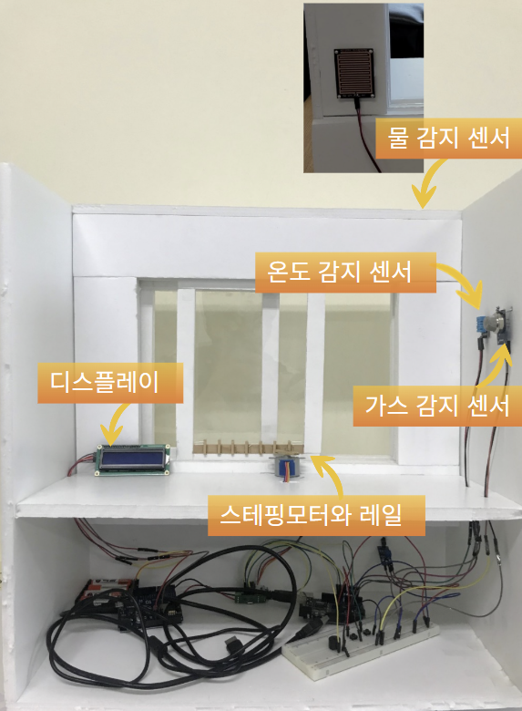

# SmartWindow
이 프로젝트는 2021년 상명대학교 스터디상생플러스 프로그램의 일환으로 개발되었습니다. (2021-3-25 ~ 2021-5-31)
스마트윈도우 프로젝트는 주변 환경 센서(비, 가스, 온도) 데이터에 따라 창문을 자동으로 개폐하는 시스템입니다.
또한, 사용자가 수동으로 창문을 제어할 수 있는 버튼과 현재 상태를 표시하는 LCD를 포함하고 있습니다. 

<table>
  <tr>
    <td style="text-align: center;">SmartWindow</td>
  </tr>
  <tr>
    <td></td>
  </tr>
</table>

##주요기능 (Main Features)
*   **자동 창문 제어 (Automatic Window Control):**
    *   빗물 감지 시 창문 자동 닫힘 기능
    *   가스 누출 또는 설정 온도 이상 상승 시 창문 자동 열림 기능 (단, 비가 오지 않을 경우)
*   **수동 창문 제어 (Manual Window Control):**
    *   창문 열림 및 닫힘 버튼을 통한 수동 조작 가능
*   **상태 표시 (Status Display):**
    *   LCD를 통해 현재 온도 및 비 감지 여부 등 상태 정보 표시
*   **알림 기능 (Notification):**
    *   가스 누출 감지 시 부저를 통한 경고음 발생

##기술스택 (Technology Stack)

*   **하드웨어 (Hardware):**
    *   마이크로컨트롤러 (Microcontroller): Arduino 또는 호환 보드 (Arduino Uno 등)
    *   액추에이터 (Actuator): 스테퍼 모터 (Stepper Motor) - 창문 개폐용
    *   센서 (Sensors):
        *   DHT11 (온습도 센서 - Temperature and Humidity Sensor)
        *   빗물 감지 센서 (Rain Sensor - Analog)
        *   가스 감지 센서 (Gas Sensor - Analog MQ series etc.)
    *   디스플레이 (Display): LiquidCrystal I2C LCD (16x2)
    *   입력장치 (Input): 푸시 버튼 (Push Buttons)
    *   알림장치 (Notification): 부저 (Buzzer)
*   **소프트웨어 (Software):**
    *   개발 환경 (IDE): Arduino IDE
    *   프로그래밍 언어 (Programming Language): Arduino (C/C++)
    *   주요 라이브러리 (Key Libraries):
        *   `Stepper.h` (스테퍼 모터 제어)
        *   `DHT11.h` (온습도 센서 데이터 읽기)
        *   `LiquidCrystal_I2C.h` (I2C LCD 제어)
        *   `Wire.h` (I2C 통신)

##프로젝트 아키텍처 (Project Architecture)

시스템은 아두이노 호환 마이크로컨트롤러를 중심으로 구성됩니다.

1.  **입력 (Inputs):**
    *   **센서 (Sensors):** 빗물 센서, 가스 센서, DHT11 온습도 센서가 환경 데이터를 수집하여 마이크로컨트롤러로 전송합니다.
    *   **수동 제어 버튼 (Manual Control Buttons):** 사용자가 창문을 직접 열거나 닫을 수 있는 인터페이스를 제공합니다.

2.  **처리 (Processing):**
    *   **마이크로컨트롤러 (Microcontroller):**
        *   센서로부터 받은 데이터를 주기적으로 분석합니다. (코드에서는 5초 평균값 사용)
        *   미리 설정된 조건 (예: 비 감지, 가스 농도 임계값 초과, 온도 임계값 초과)에 따라 창문 개폐를 결정합니다.
        *   수동 버튼 입력을 감지하여 해당 명령을 수행합니다.
        *   LCD에 현재 상태 정보를 업데이트합니다.
        *   가스 누출 시 부저를 활성화합니다.

3.  **출력 (Outputs):**
    *   **스테퍼 모터 (Stepper Motor):** 마이크로컨트롤러의 명령에 따라 창문을 물리적으로 열거나 닫습니다.
    *   **LCD 디스플레이 (LCD Display):** 현재 온도, 비 감지 상태 등의 정보를 사용자에게 시각적으로 제공합니다.
    *   **부저 (Buzzer):** 가스 누출과 같은 위험 상황 발생 시 경고음을 울립니다.

##시연 (Demonstration)
**Live URL:** [https://youtu.be/DpR10Md3rgs](https://youtu.be/DpR10Md3rgs)

